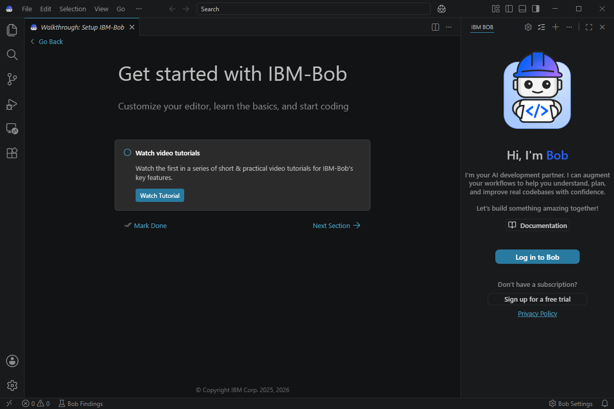
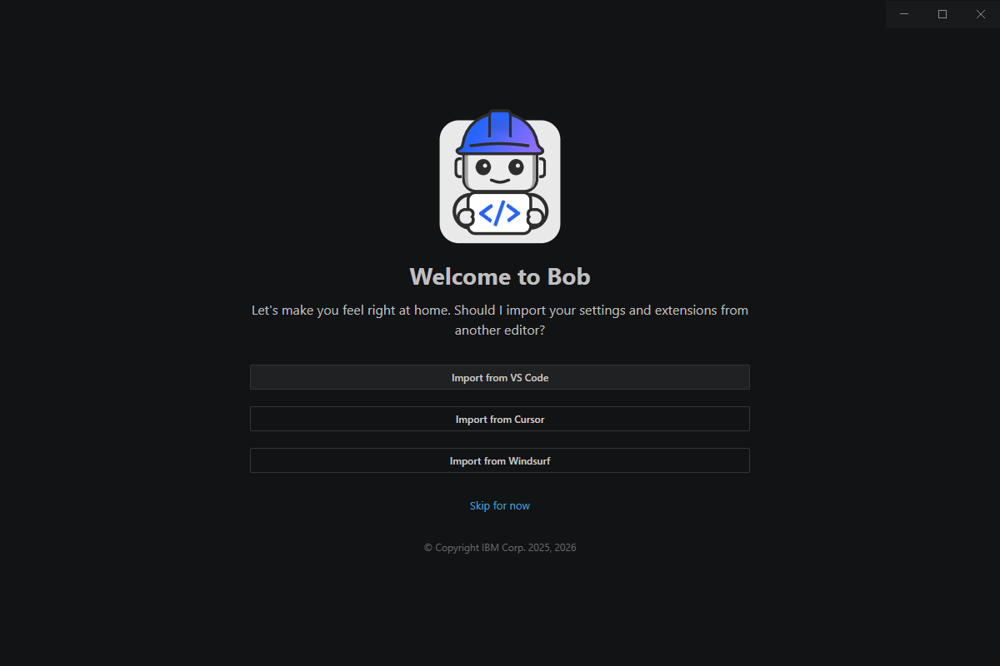
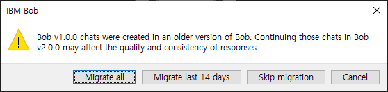

# IBM Bob Hands-on Lab 01

# IBM Bob 설치 및 프로젝트 초기 구성

> **실습 목표**
> 
> 
> IBM Bob을 설치하고 기본 화면과 실행 권한을 확인한 뒤, 실습용 `Menu.html` 파일을 로컬 프로젝트로 가져와 Bob IDE에서 열고 `/init` 명령으로 프로젝트 Context를 초기화합니다.
> 

---

## Lab 01 에서 할 일

```
Bob 계정 / Trial 준비
        ↓
IBM Bob IDE 설치
        ↓
Bob IDE 기본 화면 확인
        ↓
Mode / Permission 확인
        ↓
로컬 프로젝트 폴더 구성
        ↓
Menu.html 다운로드
        ↓
Bob IDE에서 프로젝트 열기
        ↓
/init 실행
        ↓
AGENTS.md 확인
```

### 이번 Lab에서 기억할 것

1. **Bob IDE**는 프로젝트를 열고 AI Agent와 함께 개발 작업을 수행하는 개발 환경입니다.
2. **Mode**는 Bob에게 어떤 형태의 작업을 요청할지 구분합니다.
3. **Permission**은 파일 수정이나 명령 실행을 어디까지 자동으로 허용할지 결정합니다.
4. **`/init`**은 현재 프로젝트를 분석해 Bob이 이후 작업에서 참고할 프로젝트 Context를 초기화합니다.

---

# 1. 사전 준비

실습 전에 아래 항목을 확인합니다.

- 인터넷 연결
- IBM Bob에 로그인할 계정

### 권장 환경

- Windows / macOS / Linux
- 최소 4 GB RAM
- 8 GB RAM 이상 권장
- 최소 500 MB 이상의 여유 디스크

---

# 2. IBM Bob 계정 및 Trial 준비

IBM Bob을 처음 사용하는 경우 Bob 웹사이트에서 로그인 또는 Trial 등록을 진행합니다.

- Bob 로그인: [https://bob.ibm.com/login](https://bob.ibm.com/login)
- Bob Trial: [https://bob.ibm.com/ko/trial](https://bob.ibm.com/ko/trial)

교육에서는 Google 또는 GitHub 계정을 이용해 Trial 등록을 진행할 수 있습니다.

---

# 3. IBM Bob IDE 설치

## Step 1. Bob 다운로드 페이지 접속

IBM Bob 다운로드 페이지로 이동합니다.

**다운로드 링크**

[https://bob.ibm.com/ko/download](https://bob.ibm.com/ko/download)

IBM Bob 다운로드 화면

사용 중인 운영체제에 맞는 **Bob IDE**를 다운로드합니다.

- Windows: 설치 파일 다운로드
- macOS: macOS용 설치 파일 다운로드
- Linux: Linux용 설치 방식 사용

> 이번 Hands-on에서는 **Bob IDE**를 사용합니다.
> 
> 
> Bob Shell은 별도 기능이므로 이번 Lab에서는 설치하지 않아도 됩니다.
> 

---

## Step 2. Bob IDE 설치

Windows 기준:

1. 다운로드한 설치 파일 실행
2. 설치 Wizard 진행
3. 특별한 요구사항이 없다면 기본 설치 경로 사용
4. 설치 완료 후 **IBM Bob IDE 실행**

### 완료 확인

Bob IDE가 정상적으로 실행되면 다음 단계로 이동합니다.

---

# 4. Bob IDE 최초 실행 설정 및 화면 확인

Bob IDE를 처음 실행하면 사용자의 기존 개발 환경과 이전 Bob 버전 사용 여부에 따라 몇 가지 초기 설정 화면이 표시될 수 있습니다.



최종 메인 화면

참가자마다 기존 VS Code, Cursor, Windsurf 설정이 다를 수 있으므로 이번 교육에서는 **모든 참가자가 최대한 동일한 환경에서 시작하는 것**을 기준으로 진행합니다.

---

## 4-1. 기존 Editor 설정 및 Extension 가져오기

최초 실행 시 아래와 같이 기존 Editor의 설정과 Extension을 가져올지 묻는 화면이 나타날 수 있습니다.



각 항목의 의미는 다음과 같습니다.

| 항목 | 의미 |
| --- | --- |
| **Import from VS Code** | 기존 VS Code의 일부 설정과 Extension을 Bob IDE로 가져옵니다. |
| **Import from Cursor** | 기존 Cursor 환경의 설정과 Extension을 가져옵니다. |
| **Import from Windsurf** | 기존 Windsurf 환경의 설정과 Extension을 가져옵니다. |
| **Skip for now** | 기존 Editor 환경을 가져오지 않고 Bob의 기본 환경으로 시작합니다. |

### 권장 선택

> **`Skip for now`를 선택합니다.**
> 

이유는 참가자마다 기존 Editor의 설정과 설치된 Extension이 다르기 때문입니다.

교육에서는 개인별 VS Code 환경에 의존하지 않고, **Bob IDE의 기본 환경에서 동일한 조건으로 실습**합니다.

이번 Lab에서 사용하는 `Menu.html`은 별도의 Extension이나 Node.js 패키지 없이 진행할 수 있으므로 기존 Extension을 가져오지 않아도 실습에 문제가 없습니다.

> **참고**
> 
> 
> 평소 사용하던 Editor 설정과 Extension을 그대로 활용하고 싶은 경우에는 본인의 환경에 맞는 Import 옵션을 선택할 수 있습니다.
> 
> 다만 교육 중 화면이나 동작이 다른 참가자와 달라질 수 있습니다.
> 

---

## 4-2. 이전 Bob 버전의 작업 기록 Migration

기존에 Bob v1.x 버전을 사용한 적이 있는 PC에서는 아래와 같이 이전 작업 기록을 새 버전으로 옮길지 묻는 Migration 화면이 나타날 수 있습니다.



이 화면은 **기존 Bob 사용 이력이 있는 경우에만 나타날 수 있으며**, 처음 설치한 참가자는 표시되지 않을 수 있습니다.

| 항목 | 의미 |
| --- | --- |
| **Migrate all** | 이전 버전의 기존 작업 기록 전체를 새 버전으로 이전합니다. |
| **Migrate last 14 days** | 최근 작업 기록만 새 버전으로 이전합니다. |
| **Skip migration** | 이전 작업 기록을 가져오지 않고 새 환경으로 시작합니다. |
| **Cancel** | Migration 선택을 취소하고 이전 화면으로 돌아갑니다. |

### 권장 선택

> **교육용 PC에서는 `Skip migration`을 권장합니다.**
> 

이번 Hands-on은 이전 Bob 작업 기록이 필요하지 않고, 모든 참가자가 동일한 새 작업 환경에서 시작하는 것이 목적이기 때문입니다.

IBM 공식 문서에서도 이전 작업 기록이 꼭 필요하지 않은 경우에는 **Skip Migration을 대부분의 사용자에게 권장**하고 있습니다. 사용자 설정은 버전 업그레이드 시 자동으로 이전되므로 작업 기록을 유지하기 위해 반드시 Migration을 수행할 필요는 없습니다.

### 이전 작업 기록이 필요한 경우

기존 Bob v1.x의 작업 기록을 계속 사용해야 하는 참가자는 필요에 따라 다음을 선택할 수 있습니다.

- 이전 작업 전체가 필요한 경우: **Migrate all**
- 최근 작업만 필요한 경우: **Migrate last 14 days**

> **주의**
> 
> 
> Migration은 과거 작업 기록을 새 버전에서 다시 사용할 수 있도록 이전하는 과정입니다.
> 
> 화면에도 안내되어 있듯이 이전 버전의 Chat을 새 버전에서 계속 사용할 경우 응답의 품질이나 일관성에 영향을 줄 수 있으므로, 교육 실습에서는 이전 작업 기록과 분리해서 시작하는 것을 권장합니다.
> 

## 4-3. Bob 로그인


Bob 패널에서 **Log in to Bob**을 클릭합니다.


로그인 안내 창이 나타나면 **OK**를 클릭합니다.

외부 웹사이트 열기 확인 창에서는 주소를 확인한 뒤 **Open**을 클릭합니다.


브라우저에서 준비한 계정으로 로그인합니다. 인증 후 Bob 애플리케이션을 열겠다는 안내가 나타나면 **열기 / Open**을 선택합니다.


IDE로 돌아와 URI 열기 확인 창이 표시되면, 방금 수행한 Bob 로그인에서 돌아온 요청인지 확인한 뒤 **Open**을 클릭합니다.

**완료 확인:** Bob 패널의 로그인 안내가 사라지고 채팅 입력창을 사용할 수 있어야 합니다. 브라우저만 로그인되고 IDE가 연결되지 않으면 애플리케이션 열기 안내가 차단되지 않았는지 확인합니다. Trial 계정과 IDE 로그인 계정도 비교합니다.

## 4-4. 한국어 표시 언어 설정 — 선택


Bob 패널의 설정 아이콘 또는 **Bob Settings**를 클릭합니다.


**General → Language → Configure Language**를 선택합니다.

표시 언어 목록에서 한국어(ko)를 선택합니다.

Language Pack 설치 또는 변경 안내를 따릅니다.

**Change Language and Restart** 또는 재시작 안내를 선택합니다.

재시작 후 메뉴가 한국어로 표시되는지 확인합니다. 해당 메뉴를 찾기 어려우면 Windows에서 Ctrl+Shift+P로 명령 팔레트를 열고 Configure Display Language를 검색합니다. 언어 팩을 설치할 수 없는 환경은 영문 UI로 계속 진행합니다.

> UI 언어와 Bob의 응답 언어는 별개입니다. 영문 UI에서도 한국어로 질문하거나 한국어 문서 작성을 요청할 수 있습니다.
> 

---

# 5. Mode와 Permission 확인

아직 실제 코드를 수정하지 않고, 화면에서 기능 위치와 의미만 확인합니다.

## 5-1. Mode

Bob Chat 하단에서 사용할 수 있는 Mode를 확인합니다.

| Mode | 사용 목적 | 이번 실습 예시 |
| --- | --- | --- |
| Ask | 코드를 읽고 질문에 답하거나 분석 | 프로젝트 구조와 오류 후보 설명 |
| Plan | 구현 전에 변경 범위와 절차 계획 | 수정 계획을 Markdown 문서로 작성 |
| Agent | 파일 생성·수정과 명령 실행 | 파일 다운로드, `/init`, 코드 수정 |

### Ask

프로젝트와 코드에 대해 **질문하거나 분석**할 때 사용합니다.

예:

```
이 프로젝트의 구조를 설명해줘.
```

### Plan

실제 구현 전에 **어떤 파일을 어떻게 변경할지 계획**을 확인할 때 사용합니다.

예:

```
이 기능을 수정하려면 어떤 작업이 필요한지 계획만 작성해줘.
```

### Agent

Bob이 **실제 파일을 수정하거나 명령을 실행**해야 할 때 사용합니다.

이번 Lab에서는 파일 다운로드와 `/init` 실행 시 Agent Mode를 사용합니다.

---

## 5-2. Permission

Bob Chat의 **Permission** 설정을 확인합니다.

| 작업 | 교육 권장 방식 |
| --- | --- |
| 파일 읽기 | Read 자동 승인 허용 가능 |
| 파일 생성·수정 | 대상과 변경 내용을 확인한 뒤 승인 |
| 명령 실행 | 명령 목적과 실행 위치를 확인한 뒤 승인 |
| 외부 도구 사용 | 해당 실습에서 필요한 요청인지 확인한 뒤 승인 |

Permission은 Bob이 파일 수정이나 명령 실행을 제안했을 때 자동으로 실행할지, 개발자에게 승인을 요청할지를 결정합니다.

승인 창이 표시되지 않는 경우에는 자동 승인 설정을 확인합니다. Bob의 제안을 개발자가 검토하고 승인하는 과정을 **Human-in-the-Loop**와 연결해서 이해합니다.

> **실습 포인트**
> 
> 
> Bob에게 모든 권한을 주는 것이 목적이 아닙니다.
> 
> 처음에는 파일 변경과 명령 실행 내용을 직접 확인하면서 Bob이 어떤 작업을 수행하는지 익히는 것이 좋습니다.
> 

---

# 6. 로컬 프로젝트 폴더 구성

실습 폴더를 다음과 같이 구성합니다.

Windows 예시:

```
C:\IBM-Bob-Lab\
```

Windows 예시 경로는 `C:\IBM-Bob-Lab`입니다. 해당 경로에 쓰기 권한이 없으면 사용자 문서 폴더 아래에 `IBM-Bob-Lab`을 만들어도 됩니다. macOS/Linux에서도 사용자가 쓰기 가능한 위치에 같은 이름의 폴더를 만듭니다.

1. Bob IDE에서 **File → Open Folder / 파일 → 폴더 열기**를 선택합니다.
2. `IBM-Bob-Lab` 폴더를 생성하거나 선택합니다.
3. Explorer 최상위에 해당 폴더가 표시되는지 확인합니다.

이후 요청은 **현재 열려 있는 프로젝트 폴더**를 기준으로 진행합니다. 중복으로 `IBM-Bob-Lab` 하위 폴더를 만들지 않도록 저장 위치를 확인합니다.

---

# 7. 실습용 `Menu.html` 다운로드

이번 Hands-on에서는 간단한 Café 웹페이지인 `Menu.html`을 사용합니다.

이 파일 하나에 HTML, CSS, JavaScript가 함께 포함되어 있어 별도의 패키지 설치 없이 실습할 수 있습니다.

### 실습 파일

GitHub:

[https://github.com/suh1027/IBM_Bob_Enablement/tree/main/Lab_1/file](https://github.com/suh1027/IBM_Bob_Enablement/tree/main/Lab_1/file)

사용할 파일:

```
Menu.html
```

---

## 방법 A. Bob Agent 모드를 활용하여 다운로드

간략한 설명 & 아래 질의 복사 붙여넣기 설명

```jsx
IBM-Bob-Lab 폴더 아래 Github Repository 의 html 파일을 다운로드 하고 싶어
html 파일 주소는 https://github.com/suh1027/IBM_Bob_Enablement/blob/main/Lab_1/file/Menu.html 야.
```


1. 다운로드 명령이나 파일 생성 요청이 나오면 URL과 저장 위치를 확인한 뒤 승인합니다.
2. Explorer에 `Menu.html`이 생성됐는지 확인합니다.

### 화면의 Bobcoin과 컨텍스트 사용량 읽기

**Bobcoin은 Bob의 AI 작업에 사용한 자원을 계산하는 사용량, 과금 단위**입니다. 토큰은 모델이 처리하는 텍스트 단위이며 Bobcoin과 같지 않습니다. 작업과 모델에 따라 자원 사용이 달라지므로 “요청 1회 = 1 Bobcoin”으로 설명하지 않습니다.

위 캡처의 수치는 해당 실행의 예시입니다.

| 화면 표시 | 의미 |
| --- | --- |
| 코인 아이콘 옆 `0.086` | 해당 작업 화면에 표시된 Bobcoin 사용량 |
| `14.5k / 270.0k`, `5% 사용 중` | 현재 컨텍스트 창의 토큰 사용 상태. 계정의 Bobcoin 잔액 비율이 아님 |
| 시스템 프롬프트, 도구 정의, 규칙, 스킬, 메시지 | 컨텍스트를 구성하는 정보별 사용 내역 |
| 모델 응답용 예약, 사용 가능한 공간 | 컨텍스트 창 안의 응답 예약과 가용 공간 표시 |

계정 전체 사용량과 잔여 예산은 Bob 패널 오른쪽 위 사용량 게이지 또는 **Settings → General**에서 확인합니다. 작업별 사용량과 계정 누적 사용량을 구분합니다. 캡처 수치로 참가자들의 예상 사용량을 고정하지 않습니다.

Agent로 다운로드하면 AI의 판단과 도구 호출 과정에서 사용량이 발생할 수 있습니다. 단순 다운로드 비용을 줄이려면 방법 B를 사용합니다. 동일 요청을 반복하기 전에 파일이 생성됐는지 먼저 확인합니다.

---

## 방법 B. GitHub에서 직접 다운로드

1. GitHub에서 `Menu.html`을 엽니다.
2. **Raw** 또는 **Download raw file**을 선택합니다.
3. `IBM-Bob-Lab` 폴더 아래에 `Menu.html`로 저장합니다.

---

# 8. `/init`으로 프로젝트 초기화

이제 Bob에게 현재 프로젝트를 먼저 파악하도록 합니다.

## `/init`이란?

`/init`은 현재 프로젝트를 분석하고 Bob이 이후 작업에서 참고할 프로젝트 정보를 초기화하는 명령입니다.

쉽게 표현하면:

> **`/init` = “이 프로젝트가 어떤 구조이고 어떤 기준으로 작업해야 하는지 먼저 파악해 둬.”**
> 

Bob은 프로젝트 파일과 구조를 확인하고 이후 작업에서 참고할 `AGENTS.md` 등의 Context 파일을 생성하거나 갱신할 수 있습니다.

---

## Step 1. Agent Mode 선택

Bob Chat 하단에서 **Agent Mode**를 선택합니다.

`/init` 과정에서는 프로젝트 파일을 읽고 Context 파일을 생성해야 하므로 파일 생성 권한이 필요할 수 있습니다.

---

## Step 2. `/init` 실행

Bob Chat에 아래 명령을 입력합니다.


*한국어 Context 생성 요청*

```
/init 한국어로 Markdown 파일 내용을 생성해줘.
```

Bob이 파일 읽기 또는 파일 생성을 요청하면 수행할 내용을 확인한 뒤 승인합니다.

> **강사 포인트**
> 
> 
> 여기서 바로 승인 버튼을 누르기보다 “Bob이 어떤 파일을 읽고 무엇을 생성하려고 하는지” 참가자가 한 번 확인하도록 합니다.
> 
> Session 1에서 설명한 **Human-in-the-Loop**를 실제로 경험하는 첫 지점입니다.
> 


Bob은 프로젝트 구조 확인, 주요 파일 분석, Context 문서 생성, 결과 요약 등의 작업을 진행합니다. 

실제 순서와 작업 수는 실행마다 달라질 수 있습니다.

| 승인 요청 | 의미 | 실습에서 확인할 내용 |
| --- | --- | --- |
| 이 작업에서 모든 todo 도구 승인 / Approve todo tools for task | 현재 작업의 할 일 목록 생성 진행 상태 갱신 허용 | `/init` 진행을 관리하는 요청인지 확인 후 클릭 |
| Read / 파일 읽기 | 프로젝트 내용 확인 | 실습 폴더의 파일인지 확인 |
| Edit / 파일 생성·수정 | Context 문서 저장 | `AGENTS.md` 등의 대상 경로 확인 |
| Execute / 명령 실행 | 터미널 명령 수행 | 명령의 목적과 위치 확인 후 승인 |

**Todo 도구 승인은 모든 파일 수정과 명령 실행을 일괄 승인한다는 의미가 아닙니다.** 

파일 생성이나 실행 요청이 별도로 표시되면 각각 확인합니다. 

자동 승인 설정에 따라 일부 승인 창은 나타나지 않을 수 있습니다.


캡처에서는 `Menu.html`을 HTML/CSS/JavaScript 단일 파일 프로젝트로 분석하고, 루트와 모드별 Context 문서 4개를 생성했습니다. “모든 작업 완료”와 체크된 작업 목록은 이 초기화 작업의 진행 상태를 의미합니다.

완료 메시지에서 다음을 확인합니다.

- 어떤 파일을 생성하거나 갱신했는가?
- 프로젝트와 주요 파일을 올바르게 인식했는가?
- 오류, 실패 또는 남은 작업이 있는가?
- `Menu.html` 기능을 임의로 변경하지 않았는가?

`AGENTS.md` 생성 완료는 웹페이지의 버그 수정이나 실행 검증 완료를 뜻하지 않습니다. 분석 결과에 버그 후보가 나오면 다음 Ask 단계에서 근거를 확인합니다.

---

# 9. 생성된 Context 파일 확인

`/init`이 완료되면 Explorer에서 새롭게 생성된 파일을 확인합니다.

환경이나 Bob 버전에 따라 생성되는 파일 구조는 달라질 수 있습니다.

예:

```
IBM-Bob-Lab/
├── Menu.html
├── AGENTS.md
└── .bob/
    └── ...
```

핵심은 정확히 같은 폴더 구조를 만드는 것이 아니라, **Bob이 프로젝트를 분석한 뒤 이후 작업에서 참고할 Context를 구성했다는 것**입니다.

| 파일 | 역할 |
| --- | --- |
| `Menu.html` | 실행·수정 대상 웹페이지 소스 |
| `AGENTS.md` | 프로젝트 목적, 주요 파일, 개발 방식 등 공통 Context |
| `.bob/rules-agent/AGENTS.md` | Agent의 구현 작업에서 참고할 지침 |
| `.bob/rules-ask/AGENTS.md` | Ask의 설명·분석에서 참고할 지침 |
| `.bob/rules-plan/AGENTS.md` | Plan의 설계·계획에서 참고할 지침 |

---

# 10. `AGENTS.md` 확인

Explorer에서 루트 `AGENTS.md`를 열어 아래 내용을 확인합니다.

- 웹페이지 프로젝트로 설명되어 있는가?
- 주요 파일 `Menu.html`을 정확히 인식했는가?
- HTML, CSS, JavaScript의 구성을 설명하는가?
- 실제 존재하지 않는 프레임워크, 빌드 명령, 패키지를 가정하지 않았는가?
- 향후 작업에 참고할 프로젝트 설명과 기준이 작성됐는가?

잘못된 내용은 직접 수정하거나 Bob에게 근거와 함께 정정을 요청합니다. 

프로젝트 구조가 크게 바뀌면 Context 문서도 함께 갱신합니다.

---

# 11. Ask 실습 — Bob에게 프로젝트 설명 요청

시간이 남는 경우 Ask Mode로 전환하고 아래 질문을 입력합니다.

```
현재 프로젝트의 구조와 Menu.html의 역할을 간단하게 설명해줘.
아직 코드는 수정하지 마.
```


**확인할 내용**

- Bob이 `Menu.html`을 읽고 구조를 설명하는가?
- 오류 후보에 코드 근거가 있는가?
- 코드를 수정하지 않고 분석만 수행했는가?

원본 `/init` 완료 캡처에는 메뉴 요소 선택자, 배경 이미지 CSS 문법, 제목 CSS 선택자에 관한 오류 후보가 제시되어 있습니다. 실제 다운로드한 파일과 브라우저 증상을 대조해 수정 대상을 정합니다. AI의 분석만으로 모든 후보를 확정된 버그로 판단하지 않습니다.

---

# 12. Plan 실습 — Bob에게 소스 수정 계획 작성

Mode를 **Plan**으로 전환합니다. 같은 대화에서 앞선 분석을 이어가며, 새 대화라면 수정할 오류와 재현 조건을 함께 전달합니다.

```jsx
해당 알려진 버그에 대해 수정 방안에 대해 구체적으로 수정 계획을 부탁해
구체적인 파일 명은 BUG-FIX-2026-09-28.md 로 부탁해
```


*Plan으로 수정 계획 작성*

계획 문서 생성 요청이 표시되면 저장 경로를 확인한 뒤 승인합니다. 생성된 문서를 열어 다음을 검토합니다.

- 수정 대상이 앞서 확인한 오류와 일치하는가?
- 변경할 파일·함수와 방법이 구체적인가?
- 불필요한 기능 추가나 디자인 변경이 포함되지 않았는가?
- 수정 후 기대 결과와 확인 방법이 있는가?

파일명의 날짜는 교육 예시입니다. 날짜나 파일명을 변경한다면 다음 Agent 요청에서도 동일한 이름을 사용합니다.

---

# 13. Agent 실습 — Agent로 검토한 계획 구현

계획을 확인한 뒤 Mode를 **Agent**로 변경합니다.

```jsx
BUG-FIX-2026-09-28.md의 검토한 계획을 기준으로 Menu.html을 수정해줘.
계획에 없는 기능 추가나 디자인 변경은 하지 마.
완료 후 변경한 부분과 수행한 검증, 직접 확인하지 못한 항목을 알려줘.
```


파일 수정이나 명령 실행 요청이 표시되면 계획의 범위와 일치하는지 확인하고 승인합니다. 

완료 후 변경 비교 화면(Diff)에서 어떤 코드가 바뀌었는지 확인합니다.

브라우저에서 수정 결과 검증

1. 수정된 `Menu.html`을 저장합니다.
2. Explorer 또는 편집기의 메뉴에서 **통합 브라우저 열기 / Open in Integrated Browser**가 제공되면 선택합니다.
3. 해당 메뉴가 없거나 로컬 파일을 표시하지 못하면 운영체제의 파일 탐색기에서 `Menu.html`을 Chrome 또는 Edge로 엽니다.

---

# 14. Lab 완료 확인

아래 항목이 모두 완료되면 Lab 01이 끝납니다.

- [ ]  Bob 로그인 / Trial 확인
- [ ]  IBM Bob IDE 설치
- [ ]  Bob IDE 기본 화면 확인
- [ ]  Ask / Plan / Agent Mode 확인
- [ ]  Permission 위치 확인
- [ ]  `Menu.html` 다운로드
- [ ]  `IBM-Bob-Lab` 로컬 폴더 구성
- [ ]  Bob IDE에서 프로젝트 Open
- [ ]  Agent Mode에서 `/init` 실행
- [ ]  `AGENTS.md` 등 Context 파일 확인

---

# 15. Lab 정리

이번 Lab에서는 아직 코드의 오류를 찾거나 수정하지 않았습니다.

먼저 Bob과 개발 작업을 수행하기 위한 기본 환경을 준비했습니다.

```
개발 환경 준비
      ↓
기존 소스 가져오기
      ↓
Bob에서 프로젝트 열기
      ↓
프로젝트 Context 초기화
```

### 핵심 메시지

> **Bob을 사용하는 개발은 바로 코드를 수정하는 것에서 시작하지 않습니다.**
> 
> 
> 먼저 프로젝트를 열고, Bob이 프로젝트 구조와 Context를 이해할 수 있도록 준비한 뒤 실제 분석과 구현 작업을 시작합니다.
> 

---

# 참고 자료

- IBM SkillsBuild — Use IBM Bob to Troubleshoot Your Code
    
    [https://github.com/academic-initiative/skillsbuild/blob/main/ibm-bob/troubleshoot-your-code/troubleshoot-your-code.md](https://github.com/academic-initiative/skillsbuild/blob/main/ibm-bob/troubleshoot-your-code/troubleshoot-your-code.md)
    
- IBM SkillsBuild — Menu.html
    
    [https://github.com/academic-initiative/skillsbuild/blob/main/ibm-bob/troubleshoot-your-code/file/Menu.html](https://github.com/academic-initiative/skillsbuild/blob/main/ibm-bob/troubleshoot-your-code/file/Menu.html)
    
- IBM Bob Download
    
    [https://bob.ibm.com/ko/download](https://bob.ibm.com/ko/download)
    
- IBM Bob Login
    
    [https://bob.ibm.com/login](https://bob.ibm.com/login)
    
- IBM Bob Trial
    
    [https://bob.ibm.com/ko/trial](https://bob.ibm.com/ko/trial)
    
- IBM Bob Docs
    
    [https://bob.ibm.com/ko/docs](https://bob.ibm.com/ko/docs)
