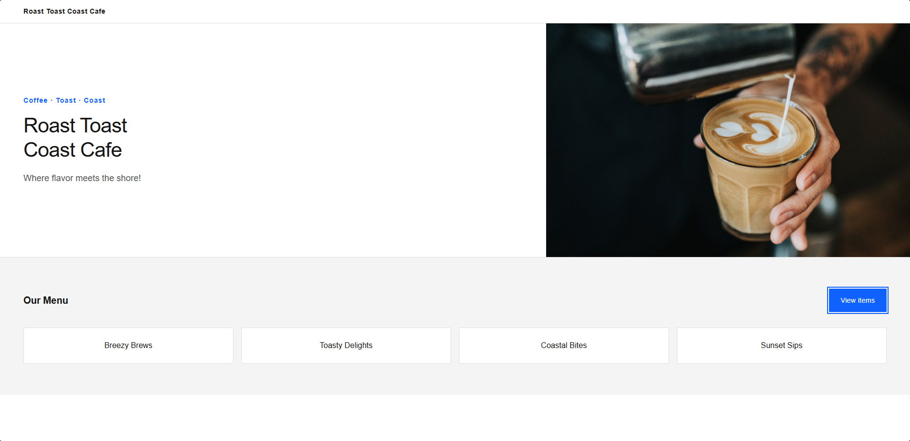

# IBM Bob Hands-on Lab 02

# Rules와 Skill 을 활용한 HTML 재구성 및 검증

> **실습 목표**
> 
> 
> Git Repository를 통해 배포된 기업 내부 개발 규칙과 Carbon Builder Skill을 IBM Bob에 적용합니다.
> 
> 기존 Café 웹페이지의 기능과 콘텐츠는 유지하면서 UI를 시각적으로 재구성하고, 변경된 코드를 Review한 뒤 최종 요구사항까지 Verify합니다.
> 
> **핵심 기능:** Rules, Skills, Ask, Plan, Agent, Review, Verify
> 

---

## 0. 이번 Lab에서 할 일

Lab 1에서는 Bob을 설치하고 프로젝트를 초기화한 뒤 기존 코드를 분석하고 수정했습니다.

Lab 2에서는 프로젝트에 **기업 내부 개발 기준과 전문 Skill을 추가하고**, 이를 실제 개발 Workflow에 활용합니다.

```
기업 내부 개발 규칙
        +
Carbon Builder Skill
        ↓
      Analyze
        ↓
       Plan
        ↓
   Human Check
        ↓
      Agent
        ↓
   UI Redesign
        ↓
  Browser Check
        ↓
Agent Validation
(html-validate)
        ↓
       Fix
        ↓
      Verify
```

Bob이 **정해진 개발 규칙과 전문 Skill을 참고하여 분석 → 계획 → 구현 → 검토 → 검증**의 순서로 작업하도록 합니다.

---

# 1. 사전 준비 확인

이번 Lab에서는 GitHub Repository에 배포된 **기업 내부 개발 규칙**과 **Carbon Builder Skill**을 현재 Bob 프로젝트에 적용한 상태에서 진행합니다.

Lab을 시작하기 전에 아래 항목이 준비되어 있는지 확인합니다.

---

## 1.1 GitHub Repository 구조 확인

GitHub Repository의 `Lab_2`에는 다음 파일이 준비되어 있습니다.

```
Lab_2/
├── company-rules/
│   └── company-standards.md
│
└── skills/
    └── carbon-builder/
        ├── README.md
        ├── SKILL.md
        └── references/
            ├── accessibility-rules.md
            ├── common-pitfalls.md
            ├── framework-rules.md
            ├── grid-system.md
            ├── implementation-guardrails.md
            ├── result-validation.md
            └── ...
```

이번 Lab에서는 위 파일을 현재 프로젝트의 `.bob` 디렉터리에 적용합니다.

---

## 1.2 Agent Mode로 전환

기업 내부 개발 규칙과 Skill 파일을 현재 프로젝트에 설정하기 위해 **Agent Mode**로 전환합니다.

이번 단계에서는 실제 디렉터리 생성과 파일 다운로드 작업이 필요합니다.

---

## 1.3 기업 내부 개발 규칙과 Carbon Builder Skill 가져오기

Agent Mode에서 아래 Prompt를 입력합니다.

```
현재 프로젝트에 Lab 2에서 사용할 개발 규칙과 Carbon Builder Skill을 설정해줘.

소스는 아래 GitHub Repository를 사용해.

Repository:
https://github.com/suh1027/IBM_Bob_Enablement

가져와야 하는 파일:

1. 기업 내부 개발 규칙

Source:
Lab_2/company-rules/company-standards.md

Destination:
현재 프로젝트/.bob/rules/company-standards.md

2. Carbon Builder Skill

Source:
Lab_2/skills/carbon-builder/

Destination:
현재 프로젝트/.bob/skills/carbon-builder/

Carbon Builder는 SKILL.md만 가져오지 말고,
references 폴더와 그 안의 모든 파일까지 포함해서
carbon-builder 폴더 전체를 가져와줘.

README.md도 함께 가져와도 돼.

작업 조건:

- 현재 프로젝트의 기존 파일은 수정하지 마.
- Menu.html과 AGENTS.md는 변경하지 마.
- 기존 .bob 디렉터리가 있다면 삭제하지 말고 필요한 폴더만 추가해.
- 기존 rules 또는 skills 파일을 임의로 삭제하지 마.
- 필요한 디렉터리가 없다면 생성해.
- GitHub에서 파일을 가져오기 위해 필요한 명령을 실행하기 전에 보여주고 승인을 요청해.
- 다운로드가 완료된 후 실제 파일이 생성되었는지 확인해.

최종적으로 아래 구조가 만들어져야 해.

.bob/
├── rules/
│   └── company-standards.md
└── skills/
    └── carbon-builder/
        ├── SKILL.md
        ├── README.md
        └── references/
            └── ...

설치가 완료되면 다음 내용을 알려줘.

1. 생성한 디렉터리
2. 다운로드한 파일
3. company-standards.md 설치 위치
4. carbon-builder Skill 설치 위치
5. references 폴더가 정상적으로 포함되었는지 여부
```

---

## 1.4 설치 결과 확인

설치가 완료되면 Bob Explorer에서 다음 구조가 생성되었는지 확인합니다.

```
현재 프로젝트/
├── Menu.html
├── AGENTS.md
│
└── .bob/
    ├── rules/
    │   └── company-standards.md
    │
    └── skills/
        └── carbon-builder/
            ├── README.md
            ├── SKILL.md
            └── references/
                └── ...
```

특히 아래 경로를 확인합니다.

```
.bob/rules/company-standards.md

.bob/skills/carbon-builder/SKILL.md

.bob/skills/carbon-builder/references/
```

Skill의 정상 위치는 다음과 같습니다.

```
✅ .bob/skills/carbon-builder/SKILL.md
```

---

## 1.5 기업 내부 개발 규칙 확인

먼저 `company-standards.md`가 정상적으로 적용되는지 확인합니다.

Ask Mode에서 아래 Prompt를 입력합니다.

```
현재 프로젝트에서 따라야 하는 개발 규칙을 확인해줘.

특히 다음 내용을 정리해줘.

1. 코드 변경 범위에 대한 기준
2. 새로운 Dependency 추가 기준
3. 코드 변경 전 Planning 기준
4. 코드 변경 후 Review 기준
5. 최종 Verification 기준
```

정상적으로 적용되었다면 다음과 같은 내용이 포함됩니다.

```
기존 코드 우선 확인

관계없는 코드 변경 금지

새로운 Dependency 추가 전 확인

구현 전 Plan 작성

변경 후 Code Review

최종 요구사항 Verification
```

---

## 1.6 Carbon Builder Skill 확인

다음으로 Carbon Builder Skill이 정상적으로 인식되는지 확인합니다.

Bob Chat에서 아래 명령을 실행하거나 Bob Settings > Skill 에서 설치된 carbon-builder 를 확인합니다.

```
설치된 Skill 목록을 알려줘
```

Skill 목록에 다음 항목이 표시되는지 확인합니다.

```
carbon-builder
```

`carbon-builder`가 표시되면 Skill 설정이 완료된 것입니다.

#### Carbon Builder 란?

`carbon-builder`는 **IBM Carbon Design System을 기반으로 UI를 설계하고 구현할 때 참고할 수 있는 전문 Skill**입니다.

---

## 1.7 Carbon Builder Skill 구성 확인

이번 Lab에서 사용하는 Carbon Builder Skill에는 다음과 같은 Reference가 포함되어 있습니다.

```
carbon-builder/
├── SKILL.md
│
└── references/
    ├── accessibility-rules.md
    ├── common-pitfalls.md
    ├── framework-rules.md
    ├── grid-system.md
    ├── implementation-guardrails.md
    ├── result-validation.md
    └── ...
```

이번 실습에서는 이 Reference를 활용하여 기존 Café UI를 다음 관점에서 개선합니다.

```
Layout

Grid

Spacing

Typography

Responsive Design

Accessibility

Implementation Guardrails

Result Validation
```

---

## 1.8 이번 Lab에서 Carbon MCP는 사용하지 않음

이번 실습에서는 Carbon MCP를 연결하지 않습니다.

### 이번 Lab의 적용 범위

```
Carbon Component 직접 사용
        ✕

Carbon Package 설치
        ✕

Carbon MCP 연결
        ✕

Carbon Design 원칙 참고
        ○

Grid / Spacing / Typography 적용
        ○

Responsive / Accessibility 개선
        ○
```

---

## 1.9 Rule과 Skill의 차이

이번 Lab에서는 두 가지 Context를 사용합니다.

### Rules

```
.bob/rules/company-standards.md
```

> **우리 조직에서는 어떻게 개발해야 하는가?**
> 

예:

- 기존 코드 우선 분석
- 요청 범위 외 변경 금지
- 새로운 Dependency 추가 전 확인
- 구현 전 Plan 확인
- 코드 변경 후 Review
- 최종 요구사항 Verify

### Skills

```
.bob/skills/carbon-builder/
```

> **특정 작업을 어떤 방식으로 더 전문적으로 수행할 것인가?**
> 

이번 Lab에서는 Carbon Builder Skill의 로컬 Reference를 참고하여:

- Layout
- Grid
- Spacing
- Typography
- Responsive Design
- Accessibility

관점에서 기존 UI를 개선합니다.

---

# 2. 기존 웹페이지 HTML 확인

먼저 현재 `Menu.html`을 브라우저에서 실행합니다.

리디자인 전 화면과 기능을 확인합니다.

### 확인할 내용

```
현재 Layout

Header

Hero / 콘텐츠 영역

Menu 영역

색상

Typography

Button / Interaction

기존 JavaScript 기능

모바일 화면
```

이번 작업에서 **콘텐츠와 기능은 유지하지만 Visual Design은 적극적으로 변경할 수 있습니다.**

---

## 반드시 유지할 요소

```
Roast Toast Coast Cafe

"Where flavor meets the shore!"

기존 메뉴 데이터 4개

Breezy Brews
Toasty Delights
Coastal Bites
Sunset Sips

Our Menu 클릭 시 메뉴 표시 / 숨김 기능
```

---

## 변경 가능한 요소

```
현재 2열 Layout

검정 / 금색 / 오렌지 Color Palette

Typography

Header 구조

Hero Section

Menu 표현 방식

Background

Spacing

Border

Image 표현 방식

Button 디자인

Semantic HTML 구조
```

---

# 3. Ask — 기존 Café UI 분석

먼저 **Ask Mode**에서 현재 코드를 분석합니다.

이 단계에서는 파일을 수정하지 않습니다.

### Prompt

```
@Menu.html

현재 Café 웹페이지의 구조와 기존 기능을 분석해줘.

현재 프로젝트에 적용된 company-standards 개발 규칙을 준수하고,
carbon-builder Skill을 활용해서 UI 개선 가능성도 함께 검토해줘.

이번 실습에서는 Carbon MCP를 사용하지 않을 거야.

따라서 실제 Carbon Component나 @carbon 패키지,
Carbon import 코드를 새로 생성하지 말고,
carbon-builder에 포함된 로컬 reference를 참고해서
Carbon의 Layout, Grid, Spacing, Accessibility 원칙을 중심으로 분석해줘.

다음 형식으로 정리해줘.

1. 현재 HTML 구조
2. 현재 UI의 주요 영역
3. 기존 JavaScript 기능
4. 반드시 유지해야 할 데이터와 기능
5. UI 구조상 개선할 수 있는 부분
6. Responsive 관점의 개선 사항
7. Accessibility 관점의 개선 사항

아직 Menu.html은 수정하지 마.
```

---

## 확인할 내용

Bob이 다음과 같은 영역을 분석하는지 확인합니다.

```
HTML 구조

현재 Layout

기존 JavaScript

Responsive 문제

Keyboard Accessibility

Semantic HTML

ARIA

Spacing / Grid
```

예를 들어 기존:

```
<h2 onclick="toggleMenuItems()">Our Menu</h2>
```

구조에 대해:

```
Keyboard 접근이 어려움
        ↓
button으로 변경

상태 정보 없음
        ↓
aria-expanded 추가
```

처럼 분석한다면 정상입니다.

---

# 4. Plan — Visual Redesign 계획 작성

Ask 결과를 확인한 뒤 **Plan Mode**로 변경합니다.

이번에는 단순히 Responsive만 개선하는 것이 아니라 **기존 페이지와 확실히 다른 Visual Design을 만들도록 명시적으로 요청**합니다.

### 예시 Prompt

```
앞에서 수행한 Menu.html 분석 결과를 바탕으로
Café 웹페이지를 시각적으로 명확하게 리디자인하기 위한 계획을 작성해줘.
REDESIGN-2026-09-28-v1.md 파일로 작성 부탁해

현재 프로젝트의 company-standards 개발 규칙과
carbon-builder Skill의 로컬 reference를 참고해줘.

이번 실습의 목표는 단순한 반응형 개선이 아니라,
기존 페이지와 확실히 구분되는 새로운 Visual Design을 만드는 것이야.

이번 실습에서는 Carbon MCP를 사용하지 않으므로
실제 Carbon Component나 @carbon Package는 사용하지 마.
대신 Carbon Design System의 시각적 원칙을 참고해서
순수 HTML / CSS / JavaScript로 구현할 계획을 작성해줘.

[반드시 유지]

- Roast Toast Coast Cafe 이름
- "Where flavor meets the shore!" 슬로건
- 기존 메뉴 4개 데이터
- Our Menu 클릭 시 메뉴 표시 / 숨김 기능

[변경 가능]

- 기존 검정 / 금색 / 오렌지 Color Palette
- 현재 2열 Layout
- Header 구조
- Hero 영역
- Menu 표현 방식
- Background
- Typography
- Spacing
- Border
- 이미지 표현 방식
- Button 스타일
- CSS 전체 스타일링

[원하는 디자인 방향]

- Carbon Design에서 영감을 받은 밝고 현대적인 UI
- White / Light Gray 중심의 배경
- IBM Blue 계열을 Primary Accent로 사용
- 본문 텍스트는 Neutral Gray / Black 계열
- IBM Plex와 유사한 깔끔한 Sans-serif Typography
- Hero 영역을 명확하게 구성
- Menu 영역은 각각의 콘텐츠가 명확히 구분되도록 구성
- 불필요한 장식, Gradient, 과한 Shadow 사용 금지
- Border와 Layer 차이로 영역을 구분
- 충분한 White Space와 일관된 Spacing 적용
- Desktop에서는 넓고 구조적인 Layout
- Mobile에서는 자연스럽게 Single Column로 전환

기존 디자인을 최대한 유지하려고 하지 말고,
콘텐츠와 기능만 유지한 상태에서
전체 Visual Identity를 새롭게 구성해줘.

아직 파일은 수정하지 마.

다음 형식으로 계획을 작성해줘.

1. 기존 디자인에서 제거하거나 변경할 요소
2. 새로운 Color System
3. Typography 계획
4. 새로운 Layout 구조
5. Hero Section 구성
6. Menu Section 구성
7. Button / Interaction 디자인
8. Responsive 전략
9. Accessibility 개선
10. 변경 후 예상 화면 구조
11. 검증 방법
```

---

# 5. 변경 후 예상 구조 예시

```
┌─────────────────────────────────────┐
│ Roast Toast Coast Cafe              │
├─────────────────────────────────────┤
│                                     │
│  Where flavor meets the shore!      │
│                                     │
│  Fresh coffee. Coastal moments.     │
│                                     │
│  [ Our Menu ]         Café Image    │
│                                     │
├─────────────────────────────────────┤
│ OUR MENU                            │
│                                     │
│ Breezy Brews       Toasty Delights  │
│ Coastal Bites      Sunset Sips      │
│                                     │
└─────────────────────────────────────┘
```

---

# 6. Agent — 실제 UI 재구성

Plan이 적절하면 **Agent Mode**로 변경합니다.

### 예시 Prompt

```
방금 작성한 Visual Redesign Plan을 기준으로
Menu.html을 실제로 수정해줘.

이번 작업의 핵심은
기존 페이지의 기능을 유지하면서
시각적으로 확실하게 다른 Café 웹페이지로 재구성하는 것이야.

company-standards 개발 규칙과
carbon-builder Skill의 로컬 reference를 참고해줘.

[반드시 유지]

- Roast Toast Coast Cafe 이름
- 기존 슬로건
- 메뉴 4개 데이터
- 기존 메뉴 토글 기능

[반드시 변경]

- 기존 검정 / 금색 중심 Color Palette
- 현재의 단순 2열 구조
- Bogart 중심의 기존 Typography
- Header / Menu의 시각적 표현
- 기존 Spacing 체계

[새로운 디자인 방향]

- White / Light Gray 기반
- IBM Blue 계열을 Primary Accent로 사용
- Neutral Gray / Black Typography
- Carbon-inspired Color hierarchy
- Hero Section을 명확하게 구성
- Menu Section은 Hero와 분리
- Button은 명확한 Primary Action 형태
- 일관된 Spacing과 Border 사용
- 과한 Rounded Card, Gradient, Shadow 사용 금지
- Responsive Layout 적용
- Accessibility 개선

Carbon MCP를 사용하지 않으므로
실제 @carbon Component나 Package는 추가하지 마.

Carbon의 시각적 원칙을 참고해
순수 HTML / CSS / JavaScript로 구현해줘.

Menu.html 이외의 파일은 수정하지 마.

작업 완료 후 다음을 정리해줘.

1. 변경한 Color System
2. Typography 변경
3. Layout 변경
4. Hero 변경
5. Menu UI 변경
6. Accessibility 개선
7. Responsive 개선
8. 유지한 기존 기능
```

---

# 7. 브라우저에서 결과 확인

코드 수정이 완료되면 먼저 **개발자가 직접 브라우저에서 결과를 확인**합니다.



수정된 예시 HTML

Agent가 코드를 정상적으로 수정했다고 응답하더라도 실제 화면과 기능이 정상적으로 동작하는지는 직접 확인해야 합니다.

### Visual

```
□ 기존 화면과 시각적으로 명확하게 달라졌는가?

□ White / Gray 기반의 밝은 UI가 적용되었는가?

□ Blue Accent가 주요 Action에 사용되는가?

□ Hero와 Menu 영역이 명확하게 구분되는가?

□ Typography와 Spacing이 일관적인가?
```

### Function

```
□ Café 이름이 유지되는가?

□ 슬로건이 유지되는가?

□ 기존 메뉴 4개가 유지되는가?

□ Our Menu 버튼이 정상 동작하는가?

□ 메뉴 열기 / 닫기 기능이 정상 동작하는가?
```

### Responsive

브라우저 너비를 줄여봅니다.

```
□ Mobile에서 Single Column로 자연스럽게 전환되는가?

□ 텍스트가 겹치지 않는가?

□ 콘텐츠가 화면 밖으로 벗어나지 않는가?

□ 이미지 영역이 깨지지 않는가?
```

---

# 8. Agent — HTML 코드 검증 및 보완

브라우저에서 기본적인 화면과 기능을 확인했다면 **Agent Mode**를 이용하여 변경된 HTML 코드를 검증합니다.

실제 정적 검증 도구인 `html-validate`를 실행하도록 합니다.

```
Bob Agent
    ↓
html-validate 실행
    ↓
검증 결과 확인
    ↓
문제 원인 분석
    ↓
필요한 코드 수정
    ↓
html-validate 재실행
```

이를 통해 Bob이 단순히 코드를 생성하는 것뿐 아니라, **개발 도구의 실행 결과를 확인하고 다시 코드를 보완하는 Agent Workflow**를 경험할 수 있습니다.

#### html-validate란?

`html-validate`는 HTML 코드를 정적으로 분석하여 잘못된 Markup이나 HTML 규칙 위반 등을 확인하는 도구입니다.

---

## 8.1 Agent Mode에서 코드 검증 실행

**Agent Mode**에서 아래 Prompt를 입력합니다.

### 예시 Prompt

```
현재 수정된 Menu.html을 검증해줘.

먼저 Terminal에서 아래 명령을 실행해줘.

npx html-validate Menu.html

이번 작업에서 html-validate는
애플리케이션 Dependency로 추가하지 않고
일회성 코드 검증 용도로만 사용해줘.

package.json이나 프로젝트 Dependency에는 추가하지 마.

명령 실행 결과를 확인한 뒤
발견된 Error 또는 Warning을 분석해줘.

각 항목에 대해 다음 내용을 먼저 정리해줘.

1. 발생 위치
2. 발생 원인
3. 코드 또는 사용자에게 미치는 영향
4. 수정 필요 여부
5. 수정 방법

검증 결과 중 실제 수정이 필요한 항목은 수정해줘.

단, 다음 조건을 반드시 지켜줘.

- 기존 Café 콘텐츠 유지
- 기존 메뉴 4개 데이터 유지
- 기존 JavaScript 기능 유지
- 현재 Visual Design 유지
- 새로운 Framework 추가 금지
- 새로운 Package를 프로젝트 Dependency로 추가하지 않기
- 검증 문제와 관계없는 코드 변경 금지
- Menu.html 이외의 파일 수정 금지

수정이 완료되면 다시 아래 명령을 실행해서
문제가 해결되었는지 확인해줘.

npx html-validate Menu.html

마지막으로 다음 내용을 정리해줘.

1. 최초 검증 결과
2. 수정한 문제
3. 변경한 코드
4. 재검증 결과
5. 아직 남아 있는 문제
```

Node.js 가 설치되어 있지 않을 경우 추가 설치 작업이 진행될 수 있음.

---

# 9. Validation 결과 확인

Agent가 `html-validate`를 실행하면 검증 결과를 확인합니다.

전체 과정은 다음과 같습니다.

```
Menu.html
    ↓
html-validate
    ↓
Validation Error
    ↓
Agent 분석
    ↓
코드 수정
    ↓
html-validate 재실행
```


검증결과 보고서 확인

---

# 10. Verify - 요구사항과 최종 결과 비교

`html-validate`가 정상적으로 완료되었다고 해서 전체 작업이 끝난 것은 아닙니다.

`html-validate`와 Verify는 확인하는 대상이 다릅니다.

### Validation

> **코드가 정해진 HTML 규칙에 맞는가?**
> 

예:

```
HTML 구조

Markup 오류

Attribute 사용

Semantic 구조

일부 Accessibility 규칙
```

### Verify

> **우리가 처음 만들기로 했던 결과가 실제로 구현되었는가?**
> 

예:

```
콘텐츠 유지

기능 유지

Visual Redesign

Responsive

Accessibility

기업 개발 규칙 준수
```

따라서:

```
html-validate 통과
        ≠
요구사항 전체 충족
```

입니다.

---

# 11. 최종 Verify Prompt

**Ask Mode**로 전환한 뒤 다음 Prompt를 입력합니다.

```
@Menu.html

현재 최종 Menu.html을 검증해줘.

이번 작업의 목적은 기존 Café 페이지의 콘텐츠와 기능은 유지하면서,
Carbon Design 원칙을 참고해 시각적으로 명확하게 다른 UI로
재구성하는 것이었어.

현재 프로젝트의 company-standards 개발 규칙과
carbon-builder Skill의 로컬 reference도 참고해서 검증해줘.

또한 앞 단계에서 html-validate를 이용한
HTML 코드 검증 및 수정 작업을 수행했어.

다음 항목을 하나씩 확인해줘.

[기존 콘텐츠 및 기능]

1. Roast Toast Coast Cafe 이름이 유지되었는가?
2. "Where flavor meets the shore!" 슬로건이 유지되었는가?
3. 기존 메뉴 4개 데이터가 모두 유지되었는가?
4. Our Menu 열기 / 닫기 기능이 유지되었는가?

[Visual Redesign]

5. 기존 검정 / 금색 중심 디자인과 명확하게 다른 UI가 적용되었는가?
6. White / Light Gray 기반의 새로운 Color System이 일관되게 적용되었는가?
7. Blue 계열 Primary Accent가 주요 Action에 적절하게 적용되었는가?
8. Typography와 Spacing이 일관되게 개선되었는가?
9. Hero와 Menu Section이 명확한 정보 계층으로 재구성되었는가?

[Responsive / Accessibility]

10. Mobile 환경을 고려한 Responsive Layout이 적용되었는가?
11. Semantic HTML이 개선되었는가?
12. Keyboard 접근성이 개선되었는가?
13. 메뉴 열림 / 닫힘 상태를 접근성 정보로 전달하고 있는가?

[Code Validation]

14. html-validate에서 발견된 주요 문제가 해결되었는가?
15. HTML 구조상 남아 있는 검증 문제가 있는가?

[기업 내부 개발 규칙]

16. 관계없는 기능이나 코드가 추가되지 않았는가?
17. 새로운 Framework 또는 Package가 추가되지 않았는가?
18. 기존 데이터와 JavaScript 기능이 유지되었는가?
19. company-standards 개발 규칙을 준수했는가?

각 항목을 다음 상태로 평가해줘.

- 충족
- 확인 필요
- 미충족

각 결과에는 코드 기준의 간단한 근거도 함께 작성해줘.

중요:
이 단계에서는 파일을 수정하지 마.
검증 결과만 작성해줘.
```

---

# 12. Lab 2 완료

이번 Lab에서는 다음 전체 과정을 경험했습니다.

```
Git Repository
      ↓
Company Rules
      +
Carbon Builder Skill
      ↓
Analyze
      ↓
Plan
      ↓
Human Check
      ↓
Agent
      ↓
Visual Redesign
      ↓
Browser Check
      ↓
Agent Validation
(html-validate)
      ↓
Fix
      ↓
Validation Again
      ↓
Final Verify
```

---

# Lab 2 핵심 정리

### Rules

> **우리 조직에서 개발할 때 지켜야 하는 기준**
> 

```
변경 범위

Dependency

Security

Planning

Review

Verification
```

### Skills

> **특정 업무를 더 전문적이고 반복 가능한 방식으로 수행하기 위한 작업 지침**
> 

이번 Lab에서는 Carbon Builder Skill의 Reference를 활용했습니다.

### Permission

> **AI가 실제 작업을 수행하기 전에 개발자가 실행 범위를 통제**
> 

### Review

> **변경된 코드 자체에 문제가 없는지 확인**
> 

### Verify

> **최초 요구사항이 최종 결과에 제대로 반영되었는지 확인**
>
